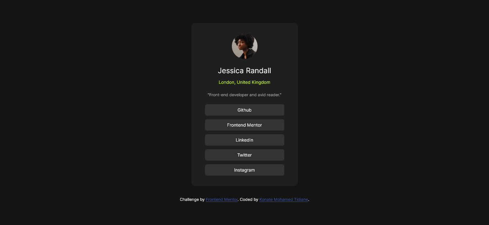

Frontend preview card project

# Frontend Mentor - previewCard

## Table of contents

- [Overview](#overview)
  - [Screenshot](#screenshot)
  - [Links](#links)
- [My process](#my-process)
  - [Built with](#built-with)
  - [What I learned](#what-i-learned)
  - [Continued development](#continued-development)
  - [Useful resources](#useful-resources)
- [Author](#author)
- [Acknowledgments](#acknowledgments)

## Overview

### Screenshot

### Links

- Solution URL: [https://github.com/Konamti/SocialLinkProfile.git]
- Live Site URL: [https://konamti.github.io/SocialLinkProfile/]

## My process

### Built with

- Semantic HTML5 markup
- CSS custom properties
- Flexbox

### What I learned

nothing new here

### Continued development

I would like to improve my ability to simply detect the type of tag to implement in my html when I see the design of the page.

### Useful resources

N/A

## Author

- Frontend Mentor - [@konamti](https://www.frontendmentor.io/profile/konamti)

## Acknowledgments

Huxn Webdev, is great programmer and I have followed most of his tutorials. He explains his code well and is always funny in his videos which makes the coding interesting even when you are tired.
